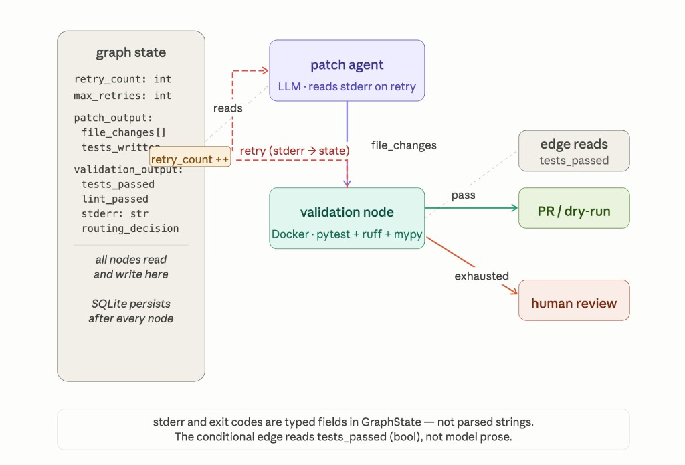
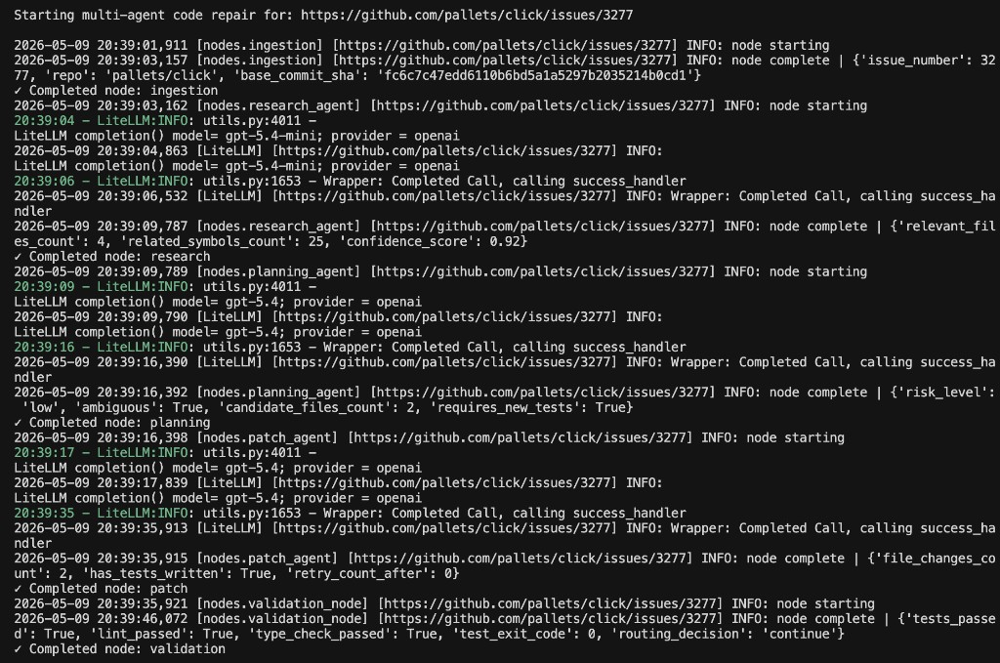
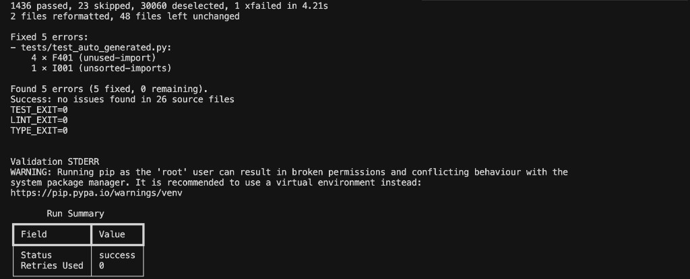
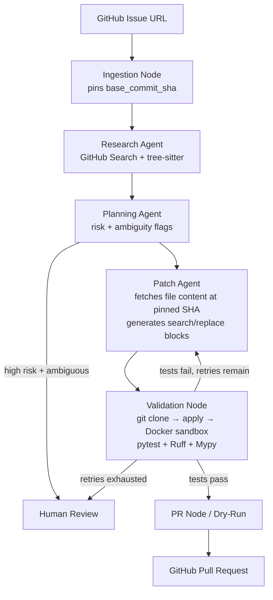
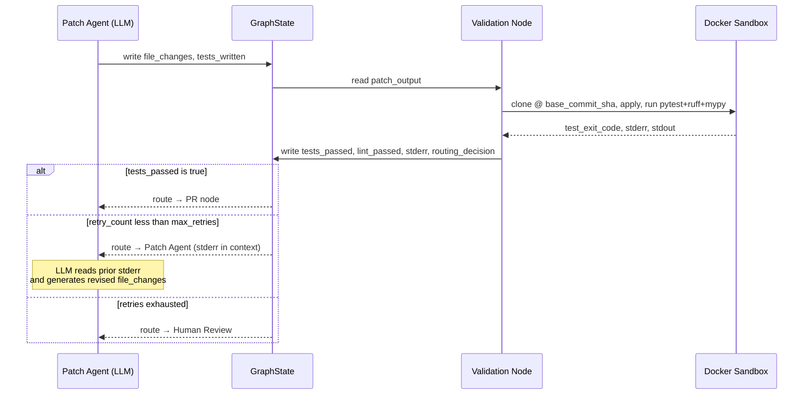

# Multi-Agent Code Repair 🔧

### Autonomous GitHub Issue → Validated Patch Pipeline · LangGraph · Docker · Search-Replace Patching

[](https://python.org)
[](https://github.com/langchain-ai/langgraph)
[](https://litellm.ai)
[](https://docker.com)
[](https://pygithub.readthedocs.io)
[](https://docs.pydantic.dev)
[](LICENSE)

> **Multi-Agent Code Repair** is a production-grade autonomous repair system — give it a GitHub issue URL and it researches the codebase, plans a minimal fix, generates structured search-replace patches grounded in verbatim file content at a pinned commit, validates them in an isolated Docker sandbox (pytest, Ruff, Mypy), retries with structured failure feedback, and opens a pull request. On a real [pallets/click](https://github.com/pallets/click) issue ([click#3277](https://github.com/pallets/click/issues/3277)), validation saw **1,436 tests passing with Ruff and Mypy clean**, **0 retries**, ~**1m 50s** wall clock, ~**$0.35** model spend ([`RESULTS.md`](RESULTS.md)).

This repository implements a **stateful LangGraph workflow**, not a prompt chain: it ingests a GitHub issue, researches the repo with **deterministic tools plus LLM reasoning**, plans a minimal change, emits **structured search-and-replace edits** grounded in **verbatim files at a pinned commit**, validates in a **resource-limited Docker sandbox** (pytest, Ruff, Mypy), **retries with structured failure feedback**, optionally opens a PR, and persists progress with **SQLite checkpointing** so runs can resume after interruptions.

If you only read one architectural lesson: **unified diffs often fail on pinned historical SHAs because models invent context lines.** This system sidesteps that class of failure by fetching real file contents at `base_commit_sha` and asking the model for explicit `search`/`replace` blocks—design driven by production failures, not a tutorial default.

## 🎬 Demo

**Architecture — graph state & retry loop** (`stderr` / `tests_passed` are typed fields; SQLite persists after every node):



**Terminal — [click#3277](https://github.com/pallets/click/issues/3277) dry-run:** node chain from ingestion through validation (pinned `base_commit_sha`, models, structured logs):



**Terminal — validation summary:** pytest + Ruff + Mypy exit codes, **1,436 passed**, status **success**, **0 retries**:



Optional: add a ~90s [asciinema](https://asciinema.org/) / QuickTime recording as **`docs/demo-run.gif`** for autoplay. Reproduce numbers: **[`RESULTS.md`](RESULTS.md)**.

---

## 🎯 What Makes This Different from a Basic Agentic System

| Signal | What this repo does |
|--------|----------------------|
| **Real integrations** | GitHub API (PyGithub), Docker SDK, LiteLLM—not mocked demos |
| **Measured on real OSS** | Benchmarks recorded against live issues; metrics in [`RESULTS.md`](RESULTS.md) |
| **Stateful orchestration** | Conditional edges over typed graph state, not a single mega-prompt |
| **Safety boundaries** | Sandboxed execution with network isolation and CPU/memory caps |
| **Operability** | SQLite checkpoints, structured logging with correlation IDs (`logging_config.py`), CI (Ruff + pytest) |
| **Honest iteration** | Patch representation evolved from fragile unified-diff apply to pinned-SHA search/replace after observing real apply failures |

## 📊 Demonstrated Outcomes

Recorded runs for **[click#3277](https://github.com/pallets/click/issues/3277)** and **[click#2811](https://github.com/pallets/click/issues/2811)** (commands and stderr excerpts) live in **[`RESULTS.md`](RESULTS.md)**.

| Metric | click#3277 | click#2811 |
|--------|------------|------------|
| Tests passing | **1,436 passed** | N/A (apply phase) |
| Lint (Ruff) | ✅ Clean | ✅ Clean (attempt 1) |
| Type check (Mypy) | ✅ Clean | ✅ Clean (attempt 1) |
| Retries used | **0** | 3 |
| Wall-clock time | ~1m 50s | ~2 min |
| Model cost | ~$0.35 | ~$0.40 |
| Outcome | **✅ Success** | Human review |

## 🏗️ Architecture



- **Ingestion:** Issue metadata + **pinned `base_commit_sha`** (default branch tip unless overridden).
- **Research:** LLM-suggested candidates augmented by **sanitized code search** and **tree-sitter symbol extraction** (Python-focused today).
- **Planning:** Fix strategy, risk, ambiguity flags—may route to human review before patching.
- **Patch:** JSON **`file_changes`** (path + search + replace) built using **file snapshots from GitHub at the pinned SHA**.
- **Validation:** Clone at that SHA, apply edits deterministically, optional generated test module, run pytest / Ruff / Mypy inside Docker.
- **Terminal nodes:** Open PR, dry-run artifacts, human escalation, or hard failure.

### Node responsibilities

| Node | Type | Role |
|------|------|------|
| **Ingestion** | Deterministic | Parses issue URL, fetches metadata, pins `base_commit_sha` to a fixed revision |
| **Research** | LLM + tools | Suggests candidate files via GitHub Search API; fetches content; extracts symbols with tree-sitter |
| **Planning** | LLM | Produces fix strategy, risk level, ambiguity flags; high-risk ambiguous issues route directly to human review |
| **Patch** | LLM | Fetches file content at pinned SHA; generates `file_changes` (path + search + replace); on retry receives prior `stderr` from state |
| **Validation** | Deterministic | Clones repo at pinned SHA, applies `file_changes` via Python string replace, runs pytest + Ruff + Mypy in Docker sandbox |
| **PR / Dry-run** | Deterministic | Pushes branch and opens PR, or prints patch summary with no side effects |
| **Human review** | Terminal | Explicit escalation state — reached when retries exhaust or planning flags high ambiguity |

**Deliberate non-LLM boundaries:** issue ingestion, file fetching, symbol extraction, patch application, sandbox execution, git operations, and PR creation are all deterministic. LLMs are used only where semantic reasoning is required — research, planning, and patching.

### State schema

All inter-node data flows through a single `GraphState` TypedDict. Every agent output is a Pydantic model; `as_model()` rehydrates plain dicts after SQLite checkpoint round-trips.

```
GraphState
├── issue_url: str
├── dry_run: bool
├── base_commit_sha_override: str | None
├── issue_context: IssueContext | None # repo, issue number, base_commit_sha
├── research_output: ResearchOutput | None
├── planning_output: PlanningOutput | None
├── patch_output: PatchOutput | None   # file_changes: List[FileChange]
│   └── FileChange                     # path, search, replace (optional description)
├── validation_output: ValidationOutput | None
├── pr_output: PROutput | None
├── retry_count: int                   # incremented on each patch retry
├── max_retries: int                   # default 3
├── error_message: str | None
└── final_status: str | None           # e.g. success | human_review | failed
```

Routing decisions read typed boolean fields (`tests_passed`, `retry_count`) — never parsed strings.

### The retry loop (key mechanism)

The conditional edge between validation and patch is what makes this a stateful system rather than a chain:



The critical detail: stderr from Docker is a typed field in GraphState. The patch agent doesn't receive a generic "it failed" signal — it receives the exact pytest output and search-string errors so the LLM can reason about what specifically went wrong.

## 🔬 Example Run

**Issue:** [pallets/click#3277](https://github.com/pallets/click/issues/3277) — zsh completion parse error

**Pipeline trace:**

```
[ingestion]  → pinned base_commit_sha: fc6c7c47
[research]   → 5 relevant files, 25 symbols, confidence: 0.92
[planning]   → risk: low, candidate_files: 2, requires_new_tests: true
[patch]      → 2 file_change blocks, tests_written: true
[validation] → 1,436 tests passing · lint_passed: true · type_check_passed: true · retries: 0
[dry_run]    → patch summary printed, no PR opened
```

**Result:** Validation **success** — full sandbox run green (`TEST_EXIT=0`, `LINT_EXIT=0`, `TYPE_EXIT=0`). The flaky pager integration test is **deselected in the sandbox entrypoint** (`docker/entrypoint.sh`) so Docker file-descriptor noise does not mask real regressions; see [`RESULTS.md`](RESULTS.md).

## 🚀 Quickstart

```bash
cd multi-agent-code-repair
python3 -m venv .venv
source .venv/bin/activate
pip install -r requirements.txt
cp .env.example .env
# Set GITHUB_TOKEN and model provider keys in .env
```

Build the sandbox image (required for validation):

```bash
docker build -t multi-agent-sandbox:latest -f docker/Dockerfile.sandbox .
```

Run the graph:

```bash
python main.py run --issue-url "https://github.com/owner/repo/issues/123"
```

Dry-run (no PR; prints patch summary and template payload):

```bash
python main.py run --issue-url "https://github.com/owner/repo/issues/123" --dry-run
```

Batch benchmark:

```bash
python main.py evaluate --benchmark-file evaluation/benchmark_issues.json
```

## ⚙️ Technical Decisions

**Why LangGraph instead of a linear chain?**  
Repair is inherently **stateful**: validation stderr, exit codes, and retry counts feed back into the patch node on the next hop. Typed routing reads structured fields (`tests_passed`, `retry_count`, …), not free-form prose.

**Why structured search/replace instead of unified diff?**  
`git apply` breaks when hunks do not match the pinned tree—often because models hallucinate context lines. **Search/replace grounded in fetched file bodies at `base_commit_sha`** aligns the model with reality and shrinks an entire class of merge-style failures.

**Why Pydantic at node boundaries?**  
Structured outputs keep contracts explicit; checkpoint serde stores plain dicts and **`as_model()`** rehydrates them so routing and nodes stay type-safe after resume.

**Why SQLite checkpointing?**  
`SqliteSaver` persists graph checkpoints under `checkpoints/` (ignored by git). Reusing the same **`thread_id`** lets you resume after the last completed node instead of restarting cold.

**Why Docker with network isolation and quotas?**  
Untrusted generated code runs with bounded CPU/memory and (by default) **no container network**, reducing exfiltration and surprise installs.

**Why LiteLLM?**  
One surface for multiple providers; per-stage overrides via **`RESEARCH_MODEL`**, **`PLANNING_MODEL`**, **`PATCH_MODEL`**, or **`LLM_MODEL`**.

**Where LLMs are deliberately not used**  
Issue ingestion, repo reads, symbol extraction, **deterministic application of `file_changes`**, sandbox execution, git operations, and PR creation stay non-LLM to control cost, latency, and failure modes.

**Why `base_commit_sha` pinning?**  
Research excerpts, fetched patch inputs, and the validation clone must all refer to the **same revision**. Without a pin, fast-moving default branches cause silent skew between what was read and what was executed.

**Patch hygiene (`tools/patch_sanity.py`)**  
Fast deterministic rules—empty search strings, no-op replacements, forbidden direct edits under `tests/` (tests belong in `tests_written`)—are encoded here and covered by unit tests so risky shapes are documented and regressions are caught in CI.

## 📁 Repository Layout

| Path | Role |
|------|------|
| `main.py` | CLI (`run`, `evaluate`) |
| `graph/` | Graph compilation, shared state, routing |
| `nodes/` | Node implementations (LLM + deterministic) |
| `prompts/` | Prompt builders |
| `tools/` | GitHub, Docker sandbox, templates, patch helpers |
| `docker/` | Sandbox image |
| `evaluation/` | Benchmark harness and datasets |
| `tests/` | Pytest suite (routing, sandbox markers, patch rules, integration) |

For end-to-end benchmark numbers and run logs, see **`RESULTS.md`**.
